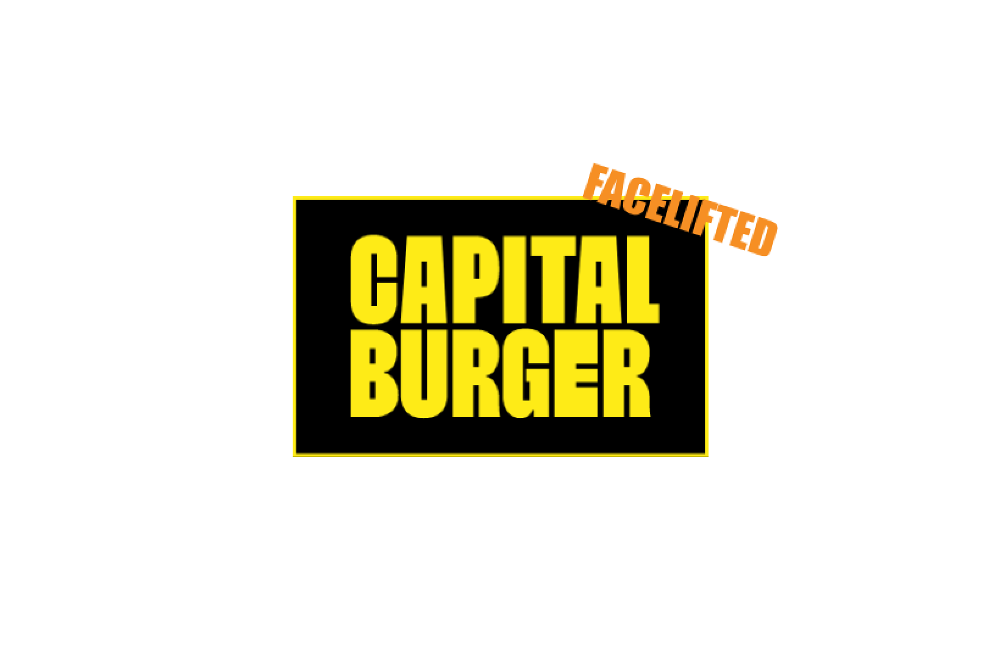
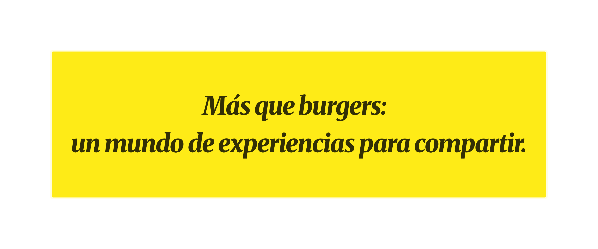
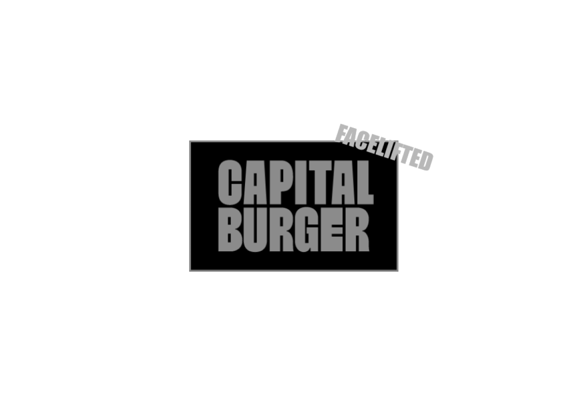
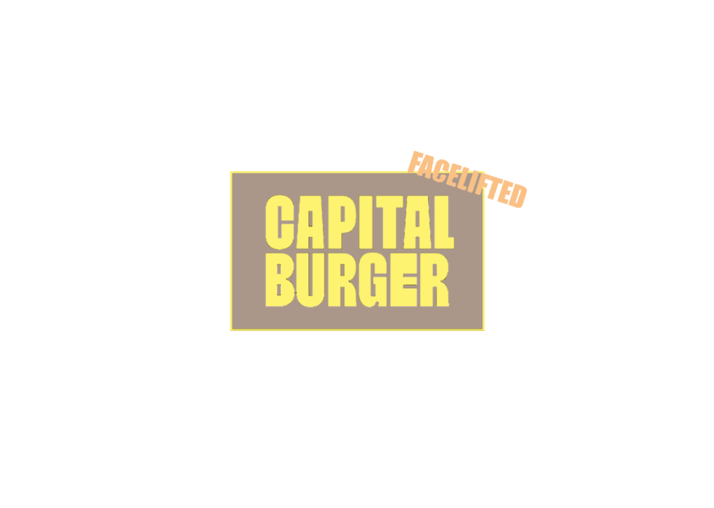
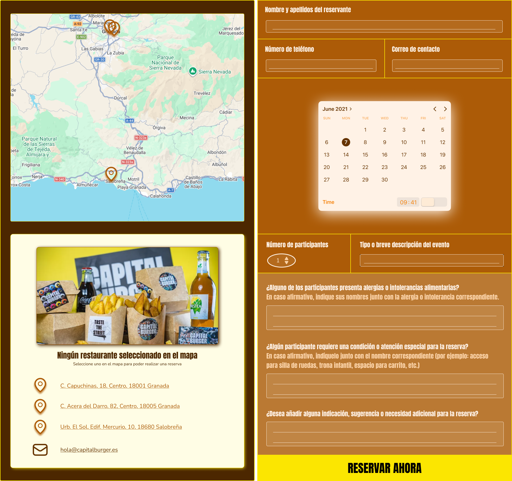
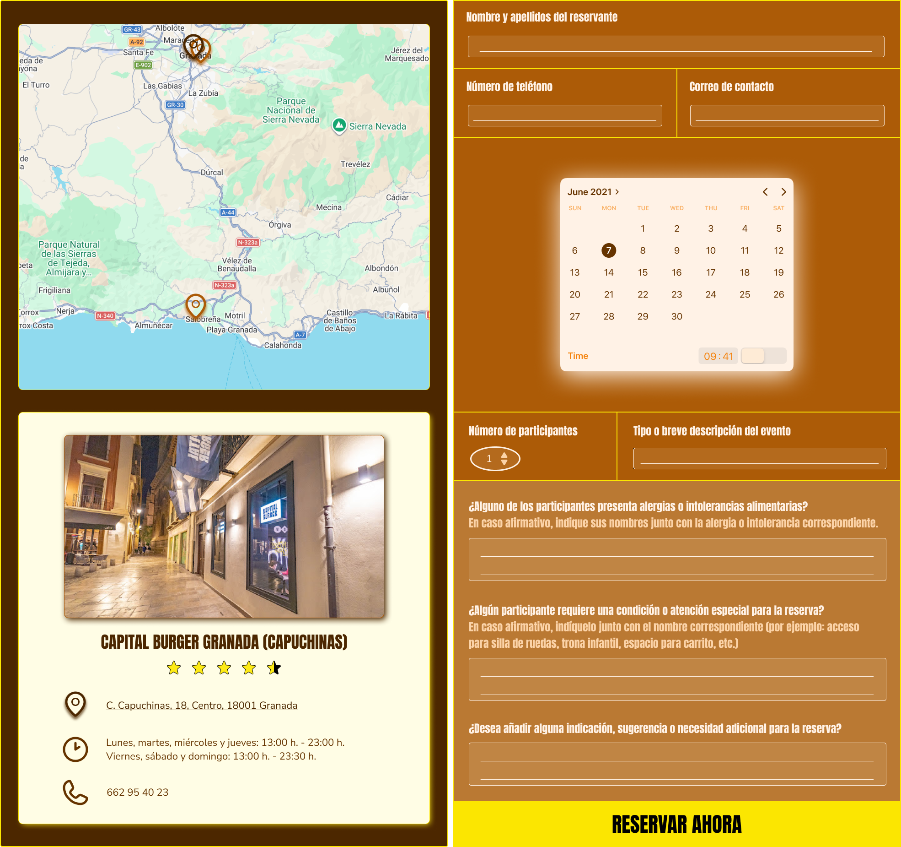
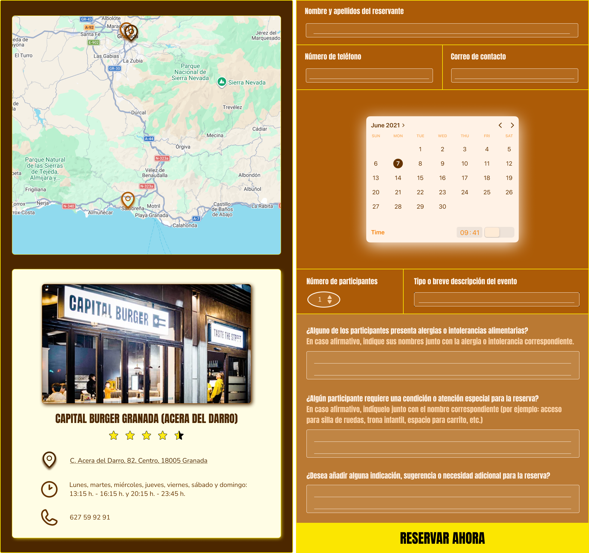
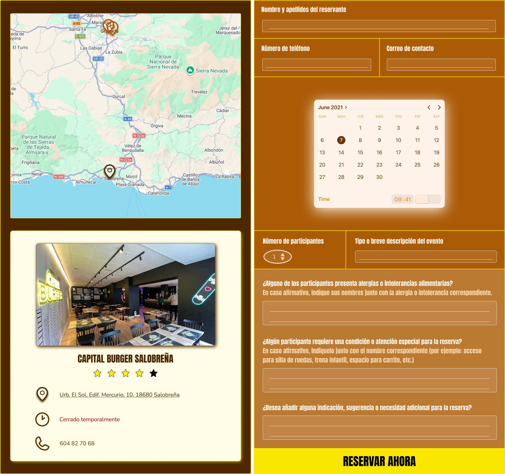
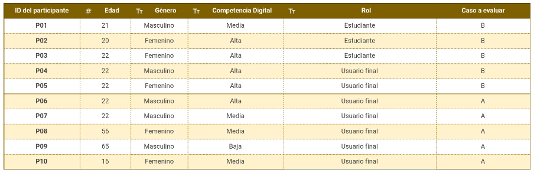

# DIU26
Prácticas Diseño Interfaces de Usuario [Tema: Sabores con encanto (Fast Food experience)]

* [Guiones de prácticas](GuionesPracticas/)
* [Guía para crea tu Case Study](Guia_CaseStudy.md)
* Sala de la Fama [DIU Hall of fame](https://github.com/mgea/DIU/tree/master/hall_of_fame) donde se pueden encontrar Case Study destacados de otros años.

Actualizado: 31/05/2026

## Paso 0 My UX-Case Study
 
-----

Grupo: DIU3_MASE.  Curso: 2025/26 

Nombre del Proyecto: **Capital Burger Facelift**

Descripción: 

La idea de nuestro proyecto es rediseñar la página web de Capital Burger para convertirla en una plataforma más intuitiva, funcional y orientada a la experiencia del usuario. No solo se busca mejorar la navegación y el acceso a información de utilidad, sino también transformar la web incorporando nuevas funcionalidades de reserva, enfocadas en la gestión y organización de eventos privados en los distintos restaurantes, así como la inclusión de una sección de próximos eventos organizados por la marca. De este modo, la página evoluciona de un sitio informativo y de pedidos a una herramienta que amplía su utilidad y facilita la interacción con los usuarios.

Logotipo: 

Eslogan:

Miembros y nombre del equipo: MASE
 * :bust_in_silhouette:  Manuel Enríquez Ledesma     :octocat:  [manuenrle](https://github.com/manuenrle)     
 * :bust_in_silhouette:  Sergio González Rodríguez     :octocat:  [ZyrearUni](https://github.com/ZyrearUni)

----- 

 

# Proceso de Diseño 

 

## Paso 1. UX User & Desk Research & Analisis 

### 1.a User Reseach Plan
 
-----

**I. Antecedentes y Objetivos (The "Why").**

- **Contexto:** Este proyecto busca mejorar la interfaz de la página web de la hamburguesería **Capital Burger**, para hacerla más comprensible, accesible y atractiva al usuario que la visite.

- **Objetivos de investigación:** Además de mejorar la experiencia del usuario al usar la plataforma, se busca determinar cómo atraer a más clientes e incrementar las ventas, tanto en el local como en la tienda online. En concreto, se evaluarán aspectos como, por ejemplo, los siguientes:

    - Si la disposición y organización de la carta de la página web permite al cliente navegar con facilidad y encontrar un producto específico en un tiempo inferior a 30 segundos.
   
    - Si el cliente puede realizar un pedido a su gusto con facilidad empleando el sistema de pedidos de la página web y si puede completarlo en un tiempo inferior a 4 minutos desde que inicia la selección hasta que hace clic en “Confirmar pedido”, pudiendo añadir, eliminar o modificar productos según sus preferencias de manera intuitiva y sin obstáculos.
   
    - Se estudiará si las imágenes de los productos e ingredientes son lo suficientemente representativas para que los usuarios puedan identificar cada opción sin necesidad de leer el texto, y, de manera inversa, si la información textual es clara y suficiente para comprender los productos en caso de que las imágenes no estuvieran disponibles.
   
    - Si el cliente puede encontrar en menos de 20 segundos la dirección del local de Capital Burger que le interese en el momento actual, así como el horario de apertura y un medio de contacto.

- **Experiencia del equipo / justificación:**
  
    - **Como clientes y entusiastas del mundo de la gastronomía**, y más concretamente del mundo de las hamburguesas, creemos que con nuestros conocimientos y experiencias en distintos locales de hamburguesas (rápidas o gourmet) podemos llegar a cumplir los objetivos de esta investigación.
   
    - **Como diseñadores**, tenemos una base de conocimientos adquiridos en usabilidad, accesibilidad y experiencia de usuario que pueden ser aplicables a este proyecto, desarrollados en otras asignaturas del Grado como Sistemas de Información Basados en Web (SIBW), Dirección y Gestión de Proyectos (DGP) y Metodologías de Desarrollo Ágil (MDA).

**II. Metodología (The "How").**

La estrategia o metodología que seguiremos para llevar a cabo nuestra investigación será la siguiente: Comenzaremos empleando una herramienta de tipo **comparativa**, que se basará en la realización de un análisis de la competencia (*Competitor Analysis*) con plataformas similares (en nuestro caso, escogeremos Mostaza Green Burger y Burger King). A continuación, crearemos personas ficticias que nos ayuden a entender mejor al público objetivo, así como mapas de experiencia del usuario (*User Journey Experience Maps*) para cada una de esas personas que nos ayudarán a describir la interacción del usuario realizando las diferentes tareas. Por último, finalizaremos con una revisión de usabilidad (*Usability Review*), donde actuaremos como expertos en usabilidad.

**III. Perfil de los Participantes (The "Who").**

A continuación, se presenta el perfil de los participantes, incluyendo criterios de inclusión y segmentación para garantizar que la investigación refleje de forma adecuada al público objetivo:

- **Criterios de inclusión:**
  
    - **Edad:** Principalmente, personas mayores de edad.

    - **Frecuencia de uso:** personas que consultan páginas web de comida rápida con regularidad.

    - **Hábitos de uso:** personas que suelen visitar la página web durante los periodos de alta demanda (la hora de comer y/o la de cenar).

    - **Nivel de competencia digital:** básica, es decir, suficiente para navegar y utilizar de manera autónoma una página web sencilla.
  
- **Segmentación:**
  
    - **Usuarios de clase (co-evaluación):** principalmente nuestro profesor y nuestros compañeros y compañeras del subgrupo 3 de prácticas de la asignatura de Diseño de Interfaces de Usuario (DIU). Se utilizarán principalmente para validar la metodología y detectar problemas importantes de usabilidad antes de probar con usuarios externos.

    - **Usuarios externos:** participantes representativos del público objetivo de la página web de Capital Burger, seleccionados de acuerdo a los criterios de inclusión definidos. Se utilizarán para comprender y evaluar mejor al público objetivo y para identificar posibles problemas que hayan podido pasar desapercibidos con los usuarios de clase.

**IV. Guión y Tareas (The "What").**

Para lograr evaluar los diferentes aspectos que hemos propuesto en el objetivo de la investigación, le vamos a pedir que el usuario haga exactamente las siguientes tareas:

- **“Busca en la carta la hamburguesa específica llamada *Metro*”.**   Para comprobar que el usuario puede encontrarla con facilidad y en un tiempo inferior a 30 segundos.

- **“Completa la siguiente simulación de pedido en la web: como entrante, escoge unos *Cheese Rings*; como hamburguesa, quédate con la *Capital Classic*; y, como bebida, pide el botellín de 500 ml de agua. Por último, elimina como entrante los *Cheese Rings* y sustitúyelos por los *Bites de Queso*, al ser un poco más baratos, y añade otro botellín de 500 ml de agua. Para finalizar tu pedido, haz clic en el botón de ‘*Confirmar pedido*’”.**   Para comprobar que el usuario puede realizar un pedido a su gusto con facilidad empleando el sistema de pedidos de la página web y completarlo en un tiempo inferior a 4 minutos, pudiendo además ajustarlo de forma sencilla según sus preferencias.

- **“Observa la hamburguesa *The Royal Burger* de la carta e identifica sus ingredientes únicamente a partir de la imagen, sin leer la descripción. Después, lee la descripción y verifica si coincide con los ingredientes que habías identificado”.**   **“Lee la descripción de la hamburguesa *La Triunfada* de la carta sin mirar la imagen. Imagina cómo sería el producto en tu mente y, luego, compara tu idea con la imagen real para ver si se asemeja a lo que habías imaginado”.**   Para evaluar si las imágenes son representativas y si la información textual es clara y suficiente para el usuario.

- **“Encuentra la dirección del local de Capital Burger que te interese, así como su horario de apertura y un medio de contacto”.**   Para comprobar que el usuario puede encontrar en menos de 20 segundos la dirección del local de Capital Burger que le interese en el momento actual, así como el horario de apertura y un medio de contacto.

**V. Cronograma y Entregables.**

A lo largo del estudio, se van a desarrollar los siguientes entregables y en el siguiente orden:

- El presente documento, **Plan de Investigación de Usuario (*User Research Plan*)**, que es el documento estratégico que define los cimientos del estudio de usabilidad. Funciona como una “hoja de ruta” que explica qué queremos aprender, a quién se los vamos a preguntar, cómo vamos a obtener los datos y cuándo estarán listos los resultados.

- Comenzaremos el estudio con la realización de un **análisis de la competencia (*Competitor Analysis*)** con plataformas similares (en nuestro caso, escogeremos Mostaza Green Burger y Burger King).

- A continuación, crearemos **personas ficticias** que nos ayuden a entender mejor al público objetivo.

- Después, elaboraremos **mapas de experiencia del usuario (*User Journey Experience Maps*)** para cada una de esas personas que nos ayudarán a describir la interacción del usuario realizando las diferentes tareas.

- Finalizaremos con una **revisión de usabilidad (*Usability Review*)**, donde actuaremos como expertos en usabilidad, recogiendo las mejoras que realizaríamos en la página web.

- Por último, también realizaremos un **Briefing**, que actuará como un resumen ejecutivo de la práctica, redactado como si quisiéramos aportar la revisión de un experto en UX/Usabilidad sobre el sitio web Capital Burger.

:link: **Enlace al documento PDF: [User Resarch Plan](P1/1.User_Research_Plan/User_Research_Plan.pdf)**

### 1.b Competitive Analysis
 
-----

Para el análisis competitivo, hemos optado por utilizar dos páginas que se centran en dos nichos distintos del mercado:

- **Burger King:** Cadena internacional de comida rápida por excelencia, con un estilo más clásico y accesible que las propuestas gourmet.

  Motivo de la elección: Se ha seleccionado Burger King para evaluar el mercado de la comida rápida, ya que es una de las cadenas de hamburguesas más reconocidas y, habitualmente, una de las primeras que vienen a la mente cuando se piensa en este tipo de producto.

- **Mostaza Green:** Restaurante popular con un toque divertido y original para personas interesadas en hamburguesas gourmet.
	
  Motivo de la elección: Se ha seleccionado también Mostaza Green para analizar el segmento de hamburguesas más gourmet. Además, es un local bastante conocido en la zona, lo que lo convierte en un buen referente para este tipo de oferta.

Ambas páginas ofrecen servicios similares a los de **Capital Burger** y son populares en nuestra zona de trabajo (Granada). Además, representan dos enfoques distintos del mercado de las hamburguesas (uno más orientado a la comida rápida y otro más cercano al estilo gourmet), lo que nos permite analizar el sector desde dos perspectivas diferentes. Por tanto, esto nos será de gran ayuda para cumplir con los objetivos de nuestra investigación.

Para poder realizar una comparativa más objetiva, hemos decidido evaluar los siguientes criterios con una puntuación de 0 a 3 estrellas:

- **Modelo de negocio:**
    - **Actualizaciones frecuentes:** la frecuencia en la que el menú ofrecido obtiene novedades.
    - **Métodos de pago:** qué métodos de pago ofrece la página para realizar el pedido (tarjeta, bizum, Google Pay, PayPal…)
    - **Estrategia de marketing:** cómo atrae la página a más clientes.

- **Arquitectura de la información:**
    - **Organización de contenidos:** si la página está bien organizada y se entiende lo que se está viendo.
    - **Menú de navegación:** si el menú de navegación es completo y fácil de comprender.
    - **Accesos rápidos:** si existen los accesos rápidos y son útiles.

- **Diseño, Usabilidad y Accesibilidad:**
    - **Diseño intuitivo:** si la página tiene un diseño sencillo, limpio, coherente y es fácil de usar.
    - **Contraste y legibilidad:** si el contenido de la página se puede entender y la paleta de colores es buena.
    - **Texto alternativo:** si las imágenes poseen un texto alternativo para lectores de pantalla.
    - **Soporte multilingüe:** si la página permite cambiar a otros idiomas.

- **UX y Funcionalidad:**
    - **Opciones de filtrado y búsqueda:** si se pueden filtrar y/o ordenar los productos dependiendo de los ingredientes, las promociones, el precio, etc.
    - **Rendimiento de la página:** que la página cargue y reaccione a los inputs del usuario de manera rápida.
    - **Contacto:** si la página posee información de contacto y esta es fácil de obtener.

- **Cuestiones subjetivas:**
    - **Puntos fuertes:** aspectos de la página que, bajo nuestro punto de vista, destacan y mejoran la experiencia del usuario.
    - **Puntos débiles:** aspectos de la página que, bajo nuestro punto de vista, pueden dificultar la experiencia o resultar menos efectivos.
    - **Conclusiones:** breve resumen de la experiencia general y aprendizajes obtenidos del análisis.

 

**CONCLUSIÓN GENERAL TRAS EL COMPETITOR ANALYSIS:**

En conclusión, el análisis muestra claras diferencias entre las páginas estudiadas.   Burger King destaca por ser la opción más completa y sólida, con un modelo de negocio muy desarrollado, lo que la convierte en una página casi perfecta.  
Mostaza Green Burger presenta una propuesta visual atractiva, con una arquitectura de la información prácticamente excelente, aunque todavía con muchos otros aspectos mejorables.  
Por último, nuestro caso de estudio, Capital Burger, a pesar de su originalidad, presenta más carencias en comparación con las otras páginas de la competencia analizadas, resultando muy mejorable en prácticamente todos los aspectos evaluados.

Por tanto, **según nuestro análisis, el orden de las páginas de mejor a peor sería el siguiente: Burger King, Mostaza Green Burger, Capital Burger**.

:link: **Enlace al documento PDF: [Competitor Analysis](P1/2.Competitor_Analysis/Competitor_Analysis.pdf)**

### 1.c Personas
 
-----

Para poder realizar un mejor análisis de la página web de Capital Burger en su estado actual, hemos optado por crear dos perfiles relativamente parecidos pero con unas claras diferencias en personalidad, contexto y necesidades.

Por un lado, se tiene a **Alberto García**, un joven almeriense de 26 años y opositor a Policía Nacional, acostumbrado a pasar largas horas estudiando solo, que emplea su propio teléfono móvil para hacer un pedido con sus amigos y así despejarse un poco y celebrar sus éxitos. Representa a un usuario con un objetivo inmediato y sencillo, sin problemas de alergias alimentarias y con una interacción directa y rápida.

Por el otro, se tiene a **Laura Jiménez**, una madre granadina de 48 años y dependienta en una joyería con ganas de pasar más tiempo con su familia, cuyo contexto es más complejo al incluir responsabilidades familiares y la presencia de alergias alimentarias en su entorno. En su caso, utiliza el ordenador familiar para realizar un pedido totalmente ajustado a las necesidades de todos los miembros de su familia, por lo que nos encontramos ante una interacción más reflexiva y orientada a la búsqueda de información, en la que la toma de decisiones requiere mayor atención.

Ambos perfiles comparten un escenario general similar: van a pedir hamburguesas para cenar con un grupo de personas. Sin embargo, el contexto de uso y las necesidades de dichos escenarios es distinto. Esta elección permite analizar cómo un mismo servicio debe adaptarse a distintos tipos de usuario, mostrando la importancia de tener en cuenta tanto personas y escenarios simples como situaciones que requieren mayor nivel de detalle en la información ofrecida y una toma de decisiones más delicada y elaborada.

:link: **Enlaces a los documentos PDF: [Persona 1: Alberto García](P1/3.Personas/Persona_1.pdf), [Persona 2: Laura Jiménez](P1/3.Personas/Persona_2.pdf)**

### 1.d User Journey Map
 
----

Con estos casos de uso hemos querido mostrar cómo se manejan distintas personas en diferentes contextos para realizar un propósito similar. Por tanto, los escenarios planteados permiten analizar dos tipos de interacción diferenciados dentro de la misma página web.

Por un lado, el escenario de **Alberto García** se centra en una experiencia de uso rápida y directa, orientada al cumplimiento eficiente de una tarea concreta (la realización de un pedido) desde su teléfono móvil. En este caso, la toma de decisiones es muy sencilla al no haber ningún tipo de alergia alimentaria, lo que permite evaluar la fluidez del proceso de realizar un pedido y la eficiencia de la interfaz.

Por otro lado, el escenario de **Laura Jiménez** se trata de un caso de navegación y exploración más complejo y detallado desde el ordenador familiar, enfocado principalmente en la búsqueda de información acerca de alérgenos y, en base a ello, tomar una decisión. Sin embargo, se encuentra con varios problemas, como la ausencia de información específica sobre alérgenos, pero tampoco encuentra un canal de contacto inmediato como es un número de teléfono para poder resolver todas sus dudas. Esta situación genera frustración y cansancio, lo que lleva finalmente a Laura y su familia a buscar otra alternativa de la competencia, como Mostaza Green Burger, una página web que sí le permite consultar toda la información que necesita y realizar el pedido con facilidad.

También hemos querido recalcar las distintas reacciones de las personas a asuntos como el precio, la disponibilidad del servicio, el coste de envío, la variedad del menú, etc. Esto permite identificar no solo problemas de usabilidad, sino también puntos más subjetivos para ampliar así las oportunidades de mejora de la página web de Capital Burger y, por tanto, de la experiencia de usuario.

:link: **Enlaces a los documentos PDF: [Journey Map de la persona 1 (Alberto García)](P1/4.Journey_Maps/Journey_Map_1.pdf), [Journey Map de la persona 2 (Laura Jiménez)](P1/4.Journey_Maps/Journey_Map_2.pdf)**

### 1.e Usability Review
 
----
  
- **Valoración numérica obtenida:** 73 - Good ("Los usuarios deberían poder utilizar este sitio con relativa facilidad y ser capaces de completar la gran mayoría de tareas importantes")
  
- **Comentario sobre la revisión:**

    - **Puntos fuertes:**  
        **i.**    Las funcionalidades principales cumplen los objetivos del usuario (hacer pedidos de forma efectiva).  
        **ii.**   Los flujos de uso están bien resueltos y permiten completar tareas sin grandes dificultades.  
        **iii.**  Acceso directo al menú desde la página principal.  
		**iv.**   Navegación intuitiva.  
		**v.**    Estructura de la web alineada con los objetivos del usuario.  
		**vi.**   Feedback constante al usuario al realizar el pedido (en el carrito).  
		**vii.**  Posibilidad de modificar, cancelar y ajustar pedidos con facilidad.  
		**viii.** Cada producto tiene su propio microformulario para determinar complementos, extras y comentarios para el restaurante.  
		**ix.**   Lenguaje claro, comprensible y consistente.  
		**x.**    Información de contacto accesible y visible.  
		**xi.**   Compatibilidad con funciones estándar del navegador.  
		**xii.**  Rendimiento aceptable sin bloquear el uso de la página web.

    - **Puntos débiles:**  
        **i.**    Falta de soporte para distintos niveles de usuario (sin ayudas ni atajos).  
        **ii.**   Problemas de contraste en algunos botones.  
        **iii.**  Página de inicio sobrecargada y poco clara  (vídeo invasivo y exceso de distracciones).  
		**iv.**   Mala jerarquía visual en la homepage que dificulta la orientación.  
		**v.**    Opciones de navegación a gusto del usuario muy limitadas (filtrado muy básico).  
		**vi.**   Ausencia total de buscador.  
		**vii.**  Obligatoriedad de registro para realizar seguimiento de pedidos.  
		**viii.** El requisito de importe mínimo al realizar un pedido, aparece demasiado tarde (al iniciar el pago).  
		**ix.**   Falta de textos alternativos en el contenido.  
		**x.**    El banner de cookies es demasiado intrusivo en dispositivos móviles.

    - **Conclusión:** El análisis muestra que los usuarios deberían poder utilizar esta página web con relativa facilidad y ser capaces de completar la gran mayoría de tareas importantes. Aunque el sitio cumple bien con su función principal, existe un claro margen de mejora en términos de usabilidad y accesibilidad, con el fin de reducir barreras y ofrecer una experiencia de usuario más completa y eficiente.

:link: **Enlace al documento PDF: [Usability Review](P1/5.Usability_Review/Usability_Review.pdf)**

### 1.f Briefing 

Tal y como se indicó en el **Plan de Investigación de Usuario (*User Research Plan*)**, este proyecto buscaba mejorar la interfaz de la página web de **Capital Burger**, haciéndola más comprensible, accesible y atractiva, con el objetivo de optimizar la experiencia del usuario y favorecer tanto las ventas online como en el local.

Para ello, comenzamos realizando un **análisis de la competencia (*Competitor Analysis*)** comparando Capital Burger con Burger King y Mostaza Green Burger. Burger King destacó por ser la opción más completa y sólida, con un modelo de negocio muy desarrollado; Mostaza Green Burger ofrecía un diseño atractivo y una arquitectura de información prácticamente excelente; Capital Burger, aunque original, presentó más carencias y oportunidades de mejora, posicionándose en último lugar.

Para analizar la página web de Capital Burger y para profundizar en la experiencia de usuario, se definieron dos personas ficticias con contextos y necesidades distintas pero un objetivo común: realizar un pedido. Alberto García, joven opositor, tuvo una experiencia rápida desde el móvil, pero se topó con problemas como aviso de cookies invasivo, pantalla de producto lenta, gastos de envío altos y obligación de registrarse para poder seguir el rastro del pedido. Laura Jiménez, madre y dependienta, realizó un pedido más complejo y delicado desde el ordenador familiar, enfrentándose a un diseño recargado y confuso, falta de información sobre alérgenos y ausencia de número de teléfono para contacto inmediato, lo que la llevó a recurrir a la competencia.
El uso de estas **personas ficticias y mapas de experiencia del usuario (*User Journey Experience Maps*)** permitió identificar problemas de diseño, usabilidad, funcionalidad y experiencia de usuario, así como aspectos subjetivos relacionados con el precio, la variedad del menú, el coste de envío, etc. Además, facilitó la búsqueda de oportunidades claras de mejora, ofreciendo recomendaciones concretas para optimizar la experiencia de usuario en la página web de Capital Burger.

Por último, finalizamos el estudio con una **revisión de usabilidad (*Usability Review*)**, donde también valoramos algunos aspectos técnicos relacionados con las funcionalidades y navegación, entre otros. Concluimos que, gracias a que la página para pedir comida está asociada a una plataforma distinta (Delitbee), Capital Burger tiene una base relativamente sólida en relación al UX de realizar un pedido. Sin embargo, la página no asociada a Delitbee le resta puntos en el resultado general.

En conclusión, la página web de Capital Burger, al igual que muchas otras páginas web de hamburgueserías similares (como la de Goikos), requiere de bastante trabajo para mejorar su interfaz y hacerla más atractiva y accesible para los distintos usuarios de esta. Discutiremos maneras de hacer esto en la siguiente práctica.

:link: **Enlace al documento PDF: [Briefing](P1/6.Briefing/Briefing.pdf)**

 

## Paso 2. UX Design  

### 2.a Reframing / IDEACION: Feedback Capture Grid / EMpathy map 
 
----

En la etapa de Ideación, hemos decidido emplear un **mapa de empatía** para recabar el comportamiento de los usuarios de la práctica 1 (y de nuestra experiencia) para así abordar mejor nuestra nueva propuesta de diseño de la página web de Capital Burger.

Gracias al mapa de empatía, hemos podido comprender en profundidad el comportamiento, las necesidades y los puntos de dolor de los usuarios. Como se detallará a continuación, este análisis ha contribuido al nacimiento de nuestro proyecto **Capital Burger Facelift**, cuya propuesta de valor tiene como propósito no solo solucionar problemas como la falta de información relevante (guía de valores nutricionales, alérgenos y contacto) y una estructura y diseño poco intuitivos que dificultan la navegación y comprensión de la página web, sino también ofrecer la posibilidad de gestionar y organizar eventos privados (despedidas, cumpleaños, etc.) en los restaurantes a través de nuestra renovada plataforma.

:link: **Enlace al documento PDF: [Customer Empathy Map](P2/1.Ideacion/Customer_Empathy_Map.pdf)**

### 2.b ScopeCanvas

----

El proyecto **Capital Burger Facelift** busca rediseñar la página web de Capital Burger, abordando las principales debilidades detectadas en el análisis competitivo realizado. En concreto, se centra en **solucionar problemas como la falta de información relevante (guía de valores nutricionales, alérgenos y contacto), y una estructura y diseño poco intuitivos que dificultan la navegación y comprensión de la página web**.

Este proyecto no solo tiene como propósito facilitar acciones claves o básicas como realizar pedidos de forma rápida o encontrar más información de utilidad, sino también transformar la web en una **plataforma orientada a la gestión y organización de eventos privados** (despedidas, cumpleaños, LAN parties, etc.). 

Por un lado, a largo plazo, el objetivo es atraer a organizaciones y promotores de eventos a la página web, fomentando el establecimiento de relaciones sólidas y duraderas con la marca. Además, se busca lograr el patrocinio de eventos para ofrecer nuestros servicios, aumentar la visibilidad de la marca y atraer a un mayor número de clientes a nuestros locales.

Por otro lado, a corto plazo, se busca aprovechar la popularidad actual de Capital Burger para impulsar la organización de eventos en nuestros locales y aumentar la notoriedad de la marca. También, se pretende incorporar nuevas e interesantes funcionalidades a la página web, con el objetivo de hacerla más atractiva y mejorar la experiencia de los usuarios.

De esta forma, se permitirá impulsar acciones como consultar los próximos eventos organizados por la empresa, visualizar un mapa interactivo con los restaurantes disponibles para eventos privados y obtener información, así como realizar reservas para su organización, con la posibilidad de modificarlas o cancelarlas. Todo ello se medirá a través de indicadores como el aumento del número de visitas a la página, el incremento en el número de reseñas y valoraciones positivas, el aumento significativo en el número de pedidos realizados por la web, el elevado número de asistentes a los eventos organizados por la empresa y el elevado número de reservas realizadas para eventos privados.

:link: **Enlace al documento PDF: [Scope Canvas](P2/2.Propuesta_de_Valor/Scope_Canvas.pdf)**

### 2.c User Flow (task) analysis 
 
-----

En esta etapa, se identifican las tareas principales y su relevancia para los usuarios. Para ello, hemos decidido realizar una matriz de tareas del usuario y tres User Flows que muestran los pasos que deben seguir los usuarios al usar nuestra página web en tres situaciones distintas relacionadas con las reservas: realizar, modificar y cancelar.

El **User Flow de *Realizar reserva*** representa el flujo del usuario para efectuar una reserva con el objetivo de organizar un evento privado en alguno de los restaurantes de Capital Burger.

El **User Flow de *Modificar reserva*** representa el flujo del usuario para hacer cambios en los datos de información de una reserva.

El **User Flow de *Cancelar reserva*** representa el flujo del usuario para anular una reserva.

Por último, se muestra la **User Task Matrix**, en la que se recogen las principales acciones que este puede llevar a cabo en relación con las nuevas funcionalidades planteadas en nuestra propuesta de valor. En ella, cada tarea ha sido valorada según su prioridad o relevancia (alta, media, baja o sin acceso) para los distintos tipos de usuario (usuario sin reserva y usuario con reserva).   Recordamos que nuestra propuesta de valor impulsa acciones entre las que destacan la consulta de los próximos eventos organizados por la empresa y también la realización de reservas para la organización de eventos privados (previa visualización de un mapa interactivo con los restaurantes disponibles y la obtención de información), con la posibilidad de modificarlas o cancelarlas.

:link: **Enlaces a los documentos PDF: [User Flows](P2/3.Analisis_de_Tareas/User_Flows.pdf), [User Task Matrix](P2/3.Analisis_de_Tareas/User_Task_Matrix.pdf)**

### 2.d IA: Sitemap + Labelling 
 
----

En este apartado, hemos propuesto una organización lógica de la navegación y elementos de diseño en la página web. Para ello, hemos generado el mapa del sitio junto con el etiquetado correspondiente.

**Sitemap**:

**Labelling**:

:link: **Enlaces a los documentos PDF: [Sitemap](P2/4.Arquitectura_de_Informacion/Sitemap.pdf), [Labelling](P2/4.Arquitectura_de_Informacion/Labelling.pdf)**

### 2.e Wireframes
 
-----

Finalmente, hemos desarrollado el prototipo mediante la creación de diferentes bocetos Lo-Fi de la **página de reservas de nuestro proyecto**.

Para ello, comenzamos con la elaboración de un **boceto inicial a mano**:

Posteriormente, diseñamos en **Figma** el **wireframe preliminar en su versión para web** (con tamaño 1440x1024px, retícula de 12 columnas, márgenes laterales de 120px e interespaciado de 20px):

También realizamos en **Figma** sus correspondientes **versiones responsive**, 

tanto para **iPad y tablet** (con tamaño 768x1024px, retícula de 8 columnas, márgenes laterales de 40px e interespaciado de 20px):

como para **móvil** (con tamaño 375x812px, retícula de 4 columnas, márgenes laterales de 16px e interespaciado de 16px):

:link: **Enlaces a los documentos PDF: [Boceto inicial a mano](P2/5.Prototipo/Boceto_inicial_a_mano.pdf), [Wireframes](P2/5.Prototipo/Wireframes.pdf)**

 

## Paso 3. Mi UX-Case Study (diseño)

### 3.a Moodboard

-----

El **moodboard** elaborado nos ha ayudado a definir la apariencia visual de nuestro proyecto. En él también se encuentra la justificación de cada decisión tomada:

Como se puede observar en el mismo, se han ideado tres versiones distintas del logo para su uso en diferentes situaciones:

Además, nuestro eslogan resume la evolución de Capital Burger hacia Capital Burger Facelift, pasando de una propuesta solo centrada en el producto a una marca orientada también a la experiencia social, en línea con nuestra estrategia:

:link: **Enlace al documento PDF: [Moodboard](P3/1.Moodboard/Moodboard.pdf)**

### 3.b Landing Page
 
----

*La Landing Page del producto se realizó a partir del moodboard con ayuda de Figma Make, con el único objetivo de que sirviera de apoyo para los siguientes pasos del proyecto. Sin embargo, no se comentará en profundidad y tan solo se añade esta breve aclaración, ya que no influye directamente en la evaluación de esta práctica, puesto que formó parte de una actividad de teoría realizada en clase.*

### 3.c Design System
 
----

*Todas las decisiones de diseño tomadas en esta sección y las diferentes herramientas (plugins, kits y recursos) de Figma empleadas se encuentran documentadas en el Briefing de la presente práctica.*

Tan solo apuntar que, **como punto fuerte del diseño destaca especialmente la página de reservas**, ya que representa el elemento principal ideado en nuestra propuesta de valor. Por ello, es uno de los aspectos en los que más se han concentrado los esfuerzos del proyecto. Aunque se puede ver todo con detalle en los enlaces que a continuación se proporcionan, se muestra previamente una serie de imágenes relacionadas con el diseño de la página de reservas:

:link: **Enlace al documento PDF: [Design System](P3/2.Design_System/Design_System.pdf)**

> [!NOTE]
> ### Enlace a Figma:
> Se ha proporcionado el enlace al archivo PDF con el resultado del Design System. No obstante, **se recomienda acceder a Figma** para una mejor evaluación, ya que podrían existir problemas de visualización del archivo PDF debido a su elevado peso y, además, en este formato no se aprecia con precisión todos los detalles del diseño.
> 
>  
>
> Por tanto, se adjunta a continuación un enlace a Figma con el archivo que contiene el Design System (junto con el Layout Hi-Fi posterior).
> 
> - [Design System y Layout Hi-Fi en Figma](https://www.figma.com/design/kqoc6ABEWMTsvEt0HThlSB/MASE---Design-System-y-Layout-Hi-Fi-P3-DIU?node-id=10-2&t=8CgtZTVuSLpmiBIY-1)

### 3.d Mockup
 
----

Para el desarrollo del **Layout Hi-Fi** hemos empleado todo el diseño elaborado y optado por un enfoque más funcional, agradable y menos cansado para la vista en comparación con la página original de Capital Burger. En todo momento se ha utilizado la tipografía definida en el moodboard y se ha prestado especial atención a que el contraste de colores fuera apropiado, siguiendo siempre la paleta cromática establecida. Se ha buscado que las páginas contengan únicamente la cantidad de contenido justa y necesaria para no fatigar al usuario, tratando además de que la experiencia sea intuitiva y sencilla de utilizar. Todo está accesible a un solo clic. Además, en el prototipo se han simulado todos los comportamientos de animación y transiciones.

:link: **Enlace al documento PDF: [Layout Hi-Fi](P3/3.Layout_Hi-Fi/Layout_Hi-Fi.pdf)**

> [!NOTE]
> ### Enlaces a Figma:
> Se ha proporcionado el enlace al archivo PDF con el resultado del Layout Hi-Fi. No obstante, **se recomienda acceder a Figma** para una mejor evaluación, ya que podrían existir problemas de visualización del archivo PDF debido a su elevado peso y, además, en este formato no se permite visualizar ni comprobar los comportamientos de animación ni las transiciones del prototipo.
> 
>  
>
> Por tanto, se adjuntan a continuación dos enlaces a Figma: uno al archivo que contiene el Layout Hi-Fi (junto con el Design System previo), y otro a la simulación interactiva del Layout Hi-Fi, donde es posible visualizar y probar su funcionamiento completo.
> 
> - [Design System y Layout Hi-Fi en Figma](https://www.figma.com/design/kqoc6ABEWMTsvEt0HThlSB/MASE---Design-System-y-Layout-Hi-Fi-P3-DIU?node-id=10-2&t=8CgtZTVuSLpmiBIY-1)
>
> - [Simulación del Layout Hi-Fi en Figma](https://www.figma.com/proto/kqoc6ABEWMTsvEt0HThlSB/MASE---Design-System-y-Layout-Hi-Fi-P3-DIU?node-id=34-20&starting-point-node-id=34%3A20&t=7bMmqCh5gpPTFGGi-1)

### 3.e Briefing 

A modo de introducción, tal y como indicábamos en nuestra propuesta de valor, el proyecto **Capital Burger Facelift** busca rediseñar la página web de Capital Burger, abordando las principales debilidades detectadas en el análisis competitivo realizado. En concreto, se centra en **solucionar problemas como la falta de información relevante, así como una estructura y un diseño poco intuitivos que dificultan la navegación y la comprensión de la página web**. Pero este proyecto no solo tiene como propósito facilitar acciones clave o básicas, como realizar pedidos de forma rápida o encontrar información de utilidad, sino también transformar la web en una plataforma orientada a la gestión y organización de eventos privados (despedidas, cumpleaños, LAN parties, etc.), incorporando así una nueva funcionalidad destacada que no se ofrecía en la web original de Capital Burger: la **posibilidad de realizar reservas para este tipo de eventos, además de permitir conocer en todo momento las últimas novedades y los próximos eventos disponibles**.

Para lograrlo, comenzamos realizando nuestro **moodboard**, que nos ayudó a definir la apariencia visual del proyecto. En él establecimos nuestra estrategia de marca, la cual consiste principalmente en un **“facelift” de la web original, mejorando su diseño y funcionalidad y aportando un enfoque más experiencial y social mediante la posibilidad de realizar reservas para organizar eventos**. También definimos nuestra identidad visual mediante tres versiones de nuestro logotipo, que consiste en una **pequeña modificación del logo original introduciendo, de forma inclinada en la esquina superior derecha, el letrero “FACELIFTED”**. Como frase motivadora o eslogan optamos por una que reflejara la esencia de nuestra marca y resumiera la evolución de Capital Burger a Capital Burger Facelift, pasando de una propuesta centrada únicamente en el producto a una marca orientada también a la experiencia social: ***“Más que burgers: un mundo de experiencias para compartir”***.

Asimismo, escogimos **imágenes propias** que reflejan no solo el enfoque experiencial del proyecto, sino que también nos ayudaron a definir nuestra paleta de colores, compuesta por los siguientes tonos: **#FEEB17**, **#F68F24**, **#FFFDE4**, **#1C0000**, **#740000** y **#462E1B**. En cuanto a la tipografía, optamos por ***Anton*** para los títulos y ***Nunito Sans*** para el cuerpo del texto, buscando así un equilibrio entre impacto visual y optimización para la lectura en pantalla. Además, seleccionamos una serie de **imágenes inspiradoras para el diseño**, de forma que nos ayudaran a transmitir correctamente el mensaje que queríamos que los usuarios percibieran y a definir de manera más clara nuestra identidad visual. Finalizamos el moodboard con diferentes **comentarios motivadores de usuarios y características interesantes de nuestros usuarios objetivo**.

Posteriormente, la **landing page** se realizó a partir de ese moodboard con ayuda de Figma Make, aunque no se va a comentar en profundidad debido a que ya no influye directamente en esta práctica, puesto que formó parte de una actividad de teoría realizada en clase.

Seguidamente, para la creación del **Design System** comenzamos utilizando uno de los plugins recomendados en el guión de prácticas: **“Deliverrr”**. Esto nos permitió disponer de paletas de color completas; un sistema tipográfico con estilos para títulos y cuerpo; espaciados, radius, shadows, opacidades…; además de variables y estilos listos para usar. A partir de esto pudimos desarrollar todo el sistema de diseño mediante átomos, moléculas, organismos y patrones.

De forma general, a lo largo de todo el diseño nos hemos apoyado en pequeños detalles de los kits de interfaz de usuario **“Simple Design System”** y **“Material 3 Design Kit”**. Igualmente, en todo el proyecto se han utilizado algunos de los iconos aportados por el plugin **“Iconify”**, destacando el icono de ubicación para los mapas, el de compartir hamburguesa por redes sociales, el de correo electrónico, el de horario, el de teléfono, el de estrella para las valoraciones o el pequeño triángulo empleado en el selector del número de participantes en una reserva para aumentar o disminuir el valor al hacer clic.

**Como punto fuerte del diseño destaca especialmente la página de reservas**, ya que representa el elemento principal ideado en nuestra propuesta de valor. Por ello, es donde más se han concentrado los esfuerzos del proyecto.
En dicha página, la sección izquierda se divide a su vez en dos partes. En la parte superior se ubica un mapa interactivo que muestra las ubicaciones de los tres restaurantes de Capital Burger. Este mapa está diseñado para que, al hacer clic sobre una ubicación concreta, se muestre justo debajo la tarjeta asociada al restaurante seleccionado, incluyendo una fotografía e información relevante acerca del mismo: nombre, valoración extraída de Google representada mediante cinco estrellas, ubicación con enlace a Google Maps, horario de apertura y teléfono de contacto. El mapa se ha implementado mediante el plugin de Figma **“Google Maps - Map Maker (free)”**.
En esa misma página, en la sección derecha, se encuentra el formulario de reserva, diseñado con un estilo muy cuidado y compuesto por distintos campos: nombre y apellidos de la persona reservante; número de teléfono; correo de contacto; un calendario para seleccionar el año, el día exacto y la hora de reserva; un selector numérico creado manualmente con la interacción adecuada para aumentar o disminuir el número de participantes mediante un pequeño triángulo; un campo para indicar el tipo o una breve descripción del evento y, por último, una pequeña sección con tres preguntas relevantes relacionadas con posibles alergias o intolerancias alimentarias, condiciones o necesidades de atención especial de alguna persona y cualquier indicación, sugerencia o necesidad adicional relacionada con la reserva. El formulario finaliza con un gran botón de “RESERVAR AHORA”, diseñado para asegurar un contraste adecuado y mantener coherencia con nuestra paleta de colores. Cabe destacar que, para el calendario, se empleó como base el recurso de la comunidad **“iOS 15 UI Kit for Figma”**, aunque posteriormente fue adaptado a nuestro estilo visual y a nuestra paleta de colores.

Para el desarrollo del **Layout Hi-Fi** **hemos empleado todo el diseño elaborado y optado por un enfoque más funcional, agradable y menos cansado para la vista en comparación con la página original de Capital Burger**. En todo momento se ha utilizado la tipografía definida en el moodboard y se ha prestado especial atención a que el contraste de colores fuera apropiado, siguiendo siempre la paleta cromática establecida. Se ha buscado que las páginas contengan únicamente la cantidad de contenido justa y necesaria para no fatigar al usuario, tratando además de que la experiencia sea intuitiva y sencilla de utilizar. Todo está accesible a un solo clic. Además, en el prototipo **se han simulado todos los comportamientos de animación y transiciones**.

En **conclusión**, consideramos que el resultado obtenido es muy positivo y que siempre existe margen de mejora. En nuestro caso, las páginas más secundarias del proyecto -es decir, aquellas menos relacionadas con nuestra propuesta de valor principal- también han sido mejoradas respecto a la versión original en términos de visibilidad y facilidad de uso, cumpliendo así otro de nuestros objetivos: lograr una web más usable y accesible para los clientes. No obstante, con más tiempo disponible, nos habría gustado seguir trabajando en el diseño de dichas páginas secundarias para perfeccionar más todos los detalles y alcanzar un resultado todavía más completo.

:link: **Enlace al documento PDF: [Briefing](P3/4.Briefing/Briefing.pdf)**

 

## Paso 4. Exportación y Documentación 

### 4.a Proceso de desarrollo: configuración y migración del diseño realizado en la práctica 3
 
----

> [!NOTE]
> ### Enlace a Figma Make:
> 
> - Configuración y migración del diseño realizado en la práctica 3, usando [Figma Make](https://www.figma.com/make/vWoaBXcNMxKLEnaAlpXwsV/MASE---P%C3%A1gina-web-Capital-Burger-Facelift-P4-DIU?t=5PVQyhOrKImre2sg-1)

### 4.b WebApp publicada

----

> [!NOTE]
> ### Enlace a la versión web en producción:
> 
> - [Página web publicada](https://user-yellow-67169682.figma.site)

### 4.c Briefing 

Antes de iniciar esta práctica 4 nos centramos en desarrollar un prototipo (Layout Hi-Fi) a partir de un **sistema de diseño creado en Figma mediante el uso de átomos, moléculas, organismos y patrones. Este sistema de diseño, elaborado en la práctica 3, nos permitió establecer una buena estructura visual y funcional desde la que comenzar a construir la página web, guiando posteriormente a Figma Make durante todo el proceso de generación e iteración**. Dicho prototipo puede observarse en la práctica 3, donde ya se apreciaban gran parte de las ideas y decisiones de diseño que finalmente se han trasladado a la versión web definitiva, manteniendo así una gran coherencia entre la conceptualización inicial y el resultado final.

Tal y como se ha mencionado anteriormente, utilizamos **Figma Make** para lanzar la versión web en producción. No obstante, **este proceso presentó algunos inconvenientes en su fase inicial**, ya que la primera generación de la página no era visualizable debido a errores de importación que no conseguíamos solucionar. **Para resolver este problema**, fue necesario crear un nuevo archivo de Figma y regenerar directamente la página desde cero. Aunque la solución obtenida en un primer momento no resultaba especialmente atractiva a nivel visual, permitió continuar con el desarrollo del proyecto y trabajar posteriormente, de manera progresiva, sobre una base funcional.

A partir de ese punto, el resto del proceso consistió principalmente en **guiar a la inteligencia artificial mediante distintas iteraciones para ajustar progresivamente la web a nuestra visión original e incluso incorporar mejoras que no aparecían en el prototipo inicial**. Más allá de los problemas iniciales ya comentados, no surgieron grandes inconvenientes durante el desarrollo. En términos generales, hemos intentado mantenernos lo más fieles posible al prototipo diseñado previamente, aunque el lanzamiento de la versión web en producción nos permitió aprovechar las posibilidades de Figma Make para añadir y perfeccionar ciertos detalles. En la **página de inicio** se mejoró el diseño del carrete de novedades y de eventos, incorporándose además tres pequeñas secciones informativas destinadas a destacar aquellos aspectos que diferencian a Capital Burger de otros restaurantes de comida rápida. En la **página de “Nosotros”** se añadió una sección de contacto al final, reutilizando componentes ya diseñados para la página de reservas, además de incluir enlaces a las redes sociales de Capital Burger. En la **página de “Carta”**, el diseño original se mantuvo prácticamente intacto, añadiéndose únicamente una subsección de menú infantil y sustituyendo el icono de compartir de las tarjetas por un icono de flecha orientado hacia la fotografía, de manera que al hacer clic sobre ella se despliega toda la información relacionada con el producto y los alérgenos asociados. En la **página de “Reservar”** también se respetó en gran medida el diseño inicial, aunque se implementaron algunas mejoras: el formulario de reserva pasó a situarse en la parte izquierda, mientras que en la parte superior derecha se muestra la fotografía y tarjeta informativa del restaurante seleccionado, ya sea escogido desde el mapa interactivo inferior o desde el selector incluido en el propio formulario. Además, en el espacio restante entre el mapa interactivo y el final de la página se incorporó una sección de preguntas frecuentes relacionadas con el proceso de reserva. Finalmente, en las **páginas de “Términos y condiciones”**, **“Política de privacidad”** y **“Política de cookies”**, las modificaciones realizadas respecto al diseño original se centraron únicamente en el formateo y organización del texto, con el objetivo de mejorar su legibilidad y facilitar la lectura por parte de los usuarios.

:link: **Enlace al documento PDF: [Briefing](P4/3.Briefing/Briefing.pdf)**

 

## Paso 5. Pruebas de Evaluación 

### 5.a.I Reclutamiento de usuarios 

-----

El caso asignado (caso B) y que nos hemos encargado de evaluar es el proyecto [*La Qarmita*](https://github.com/charlyggez/UX_CaseStudy) perteneciente al equipo *DIU2.Monki*.
>>> Breve descripción del caso asignado (llamado Caso-B) con enlace al repositorio Github
>>> Tabla y asignación de personas ficticias (o reales) a las pruebas. Exprese las ideas de posibles situaciones conflictivas de esa persona en las propuestas evaluadas. Mínimo 4 usuarios: asigne 2 al Caso A y 2 al caso B.

Se muestra a continuación la tabla demográfica del reclutamiento de 5 participantes para evaluar el proyecto *La Qarmita* (caso B) y de los 5 participantes para evaluar nuestro propio proyecto *Capital Burger Facelift* (caso A):

:link: **Enlace al documento PDF: [Plan de reclutamiento de participantes](P5/1.Plan_de_reclutamiento_de_participantes/Plan_de_reclutamiento_de_participantes.pdf)**

### 5.a.II Diseño de las pruebas 
 
-----

Para realizar nuestros hallazgos, hemos utilizado una **metodología de A/B testing**, comparando la página asignada con la que hemos creado nosotros. Para ello, hemos contado con un total de 10 participantes anónimos reclutados específicamente para la tarea.

Hemos empleado el **cuestionario SUS**, estándar en este tipo de evaluaciones, cuyos resultados y análisis se presentarán en las próximas secciones. 

Además, se han generado heatmaps mediante el seguimiento de la mirada (**Eye Tracking**) utilizando la aplicación GazeMapping, a partir de varias capturas de la página asignada.

### 5.b Aplicación del método Eye Tracking 

----

>>> Indica cómo se diseña el experimento y se reclutan los usuarios. Explica la herramienta / uso de gazerecorder.com u otra similar. Aplíquese únicamente al caso B.

  
>>> Cambiar esta img por una de vuestro experimento. El recurso deberá estar subido a la carpeta P4/  

>>> gazerecorder en versión de pruebas puede estar limitada a 3 usuarios para generar mapa de calor (crédito > 0 para que funcione) 

### 5.c Cuestionario SUS
 
----

>>> Como uno de los test para la prueba A/B testing, usaremos el **Cuestionario SUS** que permite valorar la satisfacción de cada usuario con el diseño utilizado (casos A o B). Para calcular la valoración numérica y la etiqueta linguistica resultante usamos la [hoja de cálculo](https://github.com/mgea/DIU19/blob/master/Cuestionario%20SUS%20DIU.xlsx). Previamente conozca en qué consiste la escala SUS y cómo se interpretan sus resultados
http://usabilitygeek.com/how-to-use-the-system-usability-scale-sus-to-evaluate-the-usability-of-your-website/)
Para más información, consultar aquí sobre la [metodología SUS](https://cui.unige.ch/isi/icle-wiki/_media/ipm:test-suschapt.pdf)
>>> Adjuntar en la carpeta P4/ el excel resultante y describa aquí la valoración personal de los resultados 

### 5.d A/B Testing
 
-----

>>> Los resultados de un A/B testing con 3 pruebas y 2 casos o alternativas daría como resultado una tabla de 3 filas y 2 columnas, además de un resultado agregado global. Especifique con claridad el resultado: qué caso es más usable, A o B?

### 5.f Usability Report de B
 
-----

>>> Añadir report de usabilidad para práctica B (la de los compañeros) aportando resultados y valoración de cada debilidad de usabilidad. 
>>> Enlazar aqui con el archivo subido a P4/ que indica qué equipo evalua a qué otro equipo.

>>> Complementad el Case Study en su Paso 4 con una Valoración personal del equipo sobre esta tarea

 

## Conclusiones finales & Valoración de las prácticas

>>> Opinión FINAL del proceso de desarrollo de diseño siguiendo metodología UX y valoración (positiva /negativa) de los resultados obtenidos. ¿Qué se puede mejorar? Recuerda que este tipo de texto se debe eliminar del template que se os proporciona 

